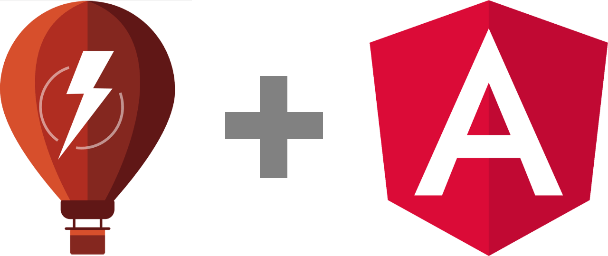
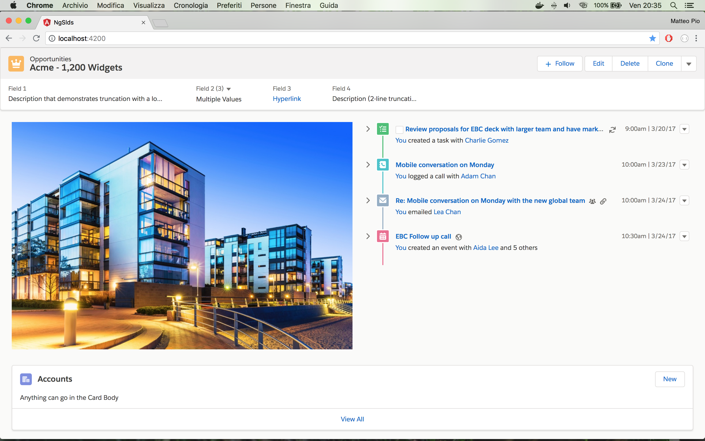

# ng-slds [](https://scrutinizer-ci.com/g/matteopio-napolitano/ng-slds/?branch=master) [](https://travis-ci.org/matteopio-napolitano/ng-slds)



This project is an example of how to integrate Salesforce Lightning Design System (SLDS) within an Angular single page application.

It was generated with [Angular CLI](https://github.com/angular/angular-cli) version 6.1.2. If suitable for you, you can install Angular CLI globally:

```
$ npm install -g @angular/cli
```

## Requirements

To explore this demo, [Node.js](https://nodejs.org) must be installed into your Operating System. 

## Getting Started

1. Open your Terminal
2. Clone this repository with `git clone https://github.com/matteopio-napolitano/ng-slds.git`
3. Move to project folder `cd ng-slds`
4. Install dependecies with `npm install`
5. Run the app `npm start`
6. Navigate to `http://localhost:4200/`. The app will automatically reload if you change any of the source files.



## How "Angular + SLDS" integration was achieved
Salesforce Lightning Design System (SLDS) can be integrated within an Angular CLI Application by loading all the necessary assets. To achieve this, it is necessary to configure properly the `angular.json` file.

First of all, we need to add SDLS as a dependency:

```
$ npm install @salesforce-ux/design-system --save
```

Next step, we configure Angular by linking the CSS style sheet:

```
"styles": [
  ...,
  ...,
  
  "node_modules/@salesforce-ux/design-system/assets/styles/salesforce-lightning-design-system.min.css"
]
```

Finally, we link all SLDS's static assets:

```
"assets": [
  ...,
  ...,
  
  { "glob": "**/*", "input": "./node_modules/@salesforce-ux/design-system/assets/fonts", "output": "/assets/fonts/" },
  { "glob": "**/*", "input": "./node_modules/@salesforce-ux/design-system/assets/icons", "output": "/assets/icons/" },
  { "glob": "**/*", "input": "./node_modules/@salesforce-ux/design-system/assets/images", "output": "/assets/images/" }
],
```

## Angular: Code scaffolding

Run `ng generate component component-name` to generate a new component. You can also use `ng generate directive|pipe|service|class|guard|interface|enum|module`.

## Angular: Build

Run `ng build` to build the project. The build artifacts will be stored in the `dist/` directory. Use the `--prod` flag for a production build.

## Angular: Running unit tests

Run `ng test` to execute the unit tests via [Karma](https://karma-runner.github.io).

## Angular: Running end-to-end tests

Run `ng e2e` to execute the end-to-end tests via [Protractor](http://www.protractortest.org/).

## Licenses

All product names, logos, and brands are property of their respective owners. All company, product and service names used in this repository are for identification purposes only.

* Source code is licensed under [MIT License](https://opensource.org/licenses/MIT)
* SLDS licenses are available [here](https://github.com/salesforce-ux/design-system/blob/master/README.md#licenses)
* Angular license is available [here](https://github.com/angular/angular/blob/master/LICENSE)

## Got feedback?

Please open a new [GitHub Issue](https://github.com/matteopio-napolitano/ng-slds/issues).